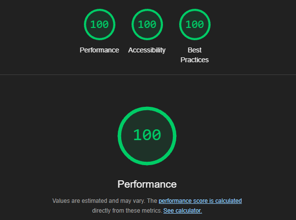

# Cloudflare Static Template
This template has the required needs to deploy the smoothest and fastest site on Cloudflare Pages. It includes the following features:
- [x] Image Optimization
- [x] HTML Minification
- [x] CSS Minification
- [x] JS Minification

## Lighthouse Score
- [x] 100% Performance for Desktop


## How to use this template
1. Fork this repository or clone it to your local machine using:
```bash
git clone https://github.com/gwashark/CloudflareStaticTemplate.git
```

2. Install the dependencies using:
```bash
npm install
```

3. Start the development server using:
```bash
npm run dev
```

4. (Optional) For production build use:
```bash
npm run serve
```

and that's it! You have a fully optimized site ready to be deployed on Cloudflare Pages. All you need to do is edit your site in the `src` folder and push it to your repository.

## License
This project is licensed under the MIT License - see the [LICENSE](LICENSE) file for details.

```
Copyright © 2024 GwaShark

Permission is hereby granted, free of charge, to any person obtaining a copy of this software and associated documentation files (the “Software”), to deal in the Software without restriction, including without limitation the rights to use, copy, modify, merge, publish, distribute, sublicense, and/or sell copies of the Software, and to permit persons to whom the Software is furnished to do so, subject to the following conditions:

The above copyright notice and this permission notice shall be included in all copies or substantial portions of the Software.

THE SOFTWARE IS PROVIDED “AS IS”, WITHOUT WARRANTY OF ANY KIND, EXPRESS OR IMPLIED, INCLUDING BUT NOT LIMITED TO THE WARRANTIES OF MERCHANTABILITY, FITNESS FOR A PARTICULAR PURPOSE AND NONINFRINGEMENT. IN NO EVENT SHALL THE AUTHORS OR COPYRIGHT HOLDERS BE LIABLE FOR ANY CLAIM, DAMAGES OR OTHER LIABILITY, WHETHER IN AN ACTION OF CONTRACT, TORT OR OTHERWISE, ARISING FROM, OUT OF OR IN CONNECTION WITH THE SOFTWARE OR THE USE OR OTHER DEALINGS IN THE SOFTWARE.
```

## How to contribute
You can contribute if you:
- Found a bug
- Have a feature request
- Want to improve the code

Create a [pull request]() with a clear description and title.
By creating a pull request, you agree to the [MIT License](LICENSE).